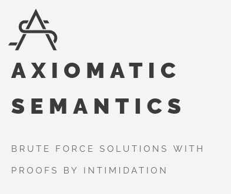

# AS-gutenberg

Testground for a revamp of [Axiomatic Semantics](https://axiomatic.neophilus.net) using the rust static site generator [Gutenberg](https://github.com/Keats/gutenberg).

Not sure if nor when this will hit prime time.
